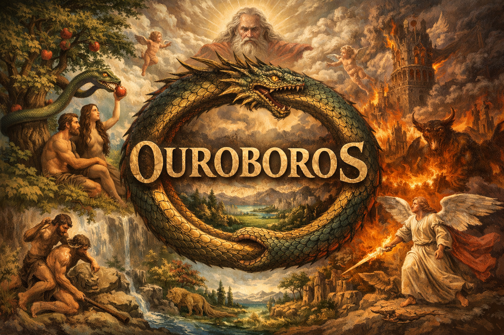

<p align="center">
  
</p>

# Ouroboros

A prompt-driven development workflow system for AI-assisted software engineering.

## Installation

Install oroboros into any project:

```bash
curl -fsSL https://raw.githubusercontent.com/Metroxe/ouroboros/main/install.sh | bash
```

To install a specific version:

```bash
curl -fsSL https://raw.githubusercontent.com/Metroxe/ouroboros/main/install.sh | bash -s -- v0.2.0
```

## Updating

Run the same install command to update. The installer:

- **Updates**: prompts, scripts, and version file
- **Preserves**: your epics, product-description.md, tech-stack.md, and any gotchas you've added
