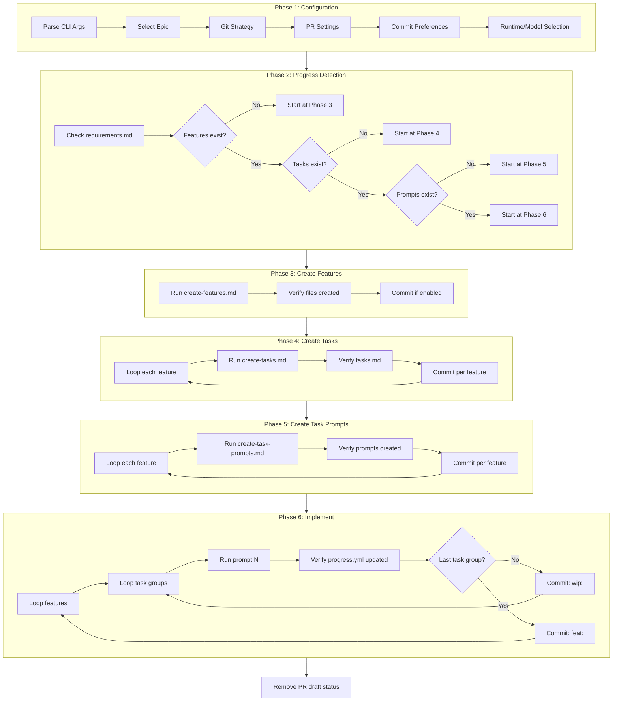

# implement-epic: Automated Epic Implementation Pipeline

This document explains the `implement-epic` script, which automates the entire workflow from a created epic through to full implementation.

## Overview

The `implement-epic` script orchestrates the complete epic-to-implementation pipeline:

1. **Configuration** - Interactive prompts (with CLI flag overrides) to configure git strategy, PR creation, and LLM runtime selection
2. **Progress Detection** - Automatically detects where you left off and resumes from that point
3. **Planning Phases** - Runs the ouroboros planning prompts (create-features, create-tasks, create-task-prompts)
4. **Implementation Phase** - Executes each task prompt to implement the feature
5. **Git Integration** - Automatic branching, commits after each step, and PR management

## Prerequisites

### Required Tools

- **Git** - Version control
- **gh CLI** - GitHub CLI (for PR creation)
  - Run `gh auth login` to authenticate

### Required LLM Runtimes (at least one)

- **Claude Code** (`claude` CLI)
- **Cursor Agent** (`cursor` CLI)
- **OpenCode** (`opencode` CLI)

## Usage

### Basic Usage

```bash
./ouroboros/scripts/implement-epic
```

This will start an interactive session where you'll be prompted for all configuration options.

### CLI Flags

All prompts can be bypassed using CLI flags:

```bash
./ouroboros/scripts/implement-epic [options]
```

| Flag | Description | Values |
|------|-------------|--------|
| `--epic=<name>` | Epic folder name to implement | e.g., `2025-01-21-user-auth` |
| `--branch=<yes\|no>` | Create a new branch | `yes` or `no` |
| `--branch-from=<name>` | Branch to create from | e.g., `main`, `develop` |
| `--bring-changes=<yes\|no>` | Bring uncommitted changes to new branch | `yes` or `no` |
| `--open-pr=<yes\|no>` | Open a draft PR | `yes` or `no` |
| `--pr-target=<name>` | Target branch for PR | e.g., `main` |
| `--commit-each=<yes\|no>` | Commit after each step | `yes` or `no` |
| `--planning-runtime=<name>` | Runtime for planning phases | `claude`, `cursor`, `opencode` |
| `--planning-model=<id>` | Model for planning phases | e.g., `claude-3-5-sonnet-latest` |
| `--impl-runtime=<name>` | Runtime for implementation | `claude`, `cursor`, `opencode` |
| `--impl-model=<id>` | Model for implementation | e.g., `claude-3-5-sonnet-latest` |
| `--verbose` | Enable verbose output | (flag) |
| `--help` | Show help message | (flag) |

### Examples

```bash
# Fully interactive
./ouroboros/scripts/implement-epic

# Specify epic, use defaults for everything else
./ouroboros/scripts/implement-epic --epic=2025-01-21-user-auth

# Full automation with all flags
./ouroboros/scripts/implement-epic \
  --epic=2025-01-21-user-auth \
  --branch=yes \
  --branch-from=main \
  --open-pr=yes \
  --pr-target=main \
  --commit-each=yes \
  --planning-runtime=claude \
  --planning-model=claude-3-5-sonnet-latest \
  --impl-runtime=claude \
  --impl-model=claude-3-5-sonnet-latest

# Use different runtimes for planning vs implementation
./ouroboros/scripts/implement-epic \
  --planning-runtime=claude \
  --impl-runtime=opencode
```

## Architecture



## Phase-by-Phase Breakdown

### Phase 1: Configuration

The script collects all necessary configuration through interactive prompts (unless CLI flags are provided):

1. **Epic Selection** - Lists all epics in `ouroboros/epics/`, sorted by date (newest first)
2. **Branch Strategy**:
   - Ask if you want to create a new branch
   - If yes, select which branch to branch from
   - Handle uncommitted changes (bring them or exit with instructions)
   - Generate branch name: `epic/{epic-name}-{N}` where N auto-increments
3. **PR Strategy**:
   - Select target branch for PR (default: main)
   - Ask if you want to open a draft PR
4. **Commit Strategy** - Whether to commit after each step
5. **Runtime/Model Selection**:
   - Select runtime and model for planning phases (3-5)
   - Select runtime and model for implementation phase (6)

### Phase 2: Setup (Branch + PR)

If branching is enabled:
1. Create the new branch with auto-generated name
2. Push the branch to origin
3. Create a draft PR (if enabled)

### Phase 3: Create Features

1. Run `ouroboros/prompts/create-features.md` with the epic path
2. Verify `features-index.yml` and feature folders were created
3. Commit: `docs: plan features for {epic-name}`

### Phase 4: Create Tasks

For each feature:
1. Run `ouroboros/prompts/create-tasks.md` with the feature path
2. Verify `tasks.md` was created
3. Commit: `docs: plan tasks for {feature-name}`

### Phase 5: Create Task Prompts

For each feature:
1. Run `ouroboros/prompts/create-task-prompts.md` with the feature path
2. Verify `prompts/progress.yml` and prompt files were created
3. Commit: `docs: create task prompts for {feature-name}`

### Phase 6: Implement

For each feature, for each task group:
1. Find the first incomplete task group from `progress.yml`
2. Run the corresponding prompt file
3. Verify `progress.yml` was updated to mark the task group complete
4. Commit with appropriate prefix:
   - `wip: {feature-name} - {task-group-name}` for intermediate steps
   - `feat: {feature-name} - {task-group-name}` for the final task group

### Finalization

1. Push any remaining commits
2. Mark the PR as ready (remove draft status)
3. Display token usage summary

## Progress Detection and Resumption

The script automatically detects your progress and resumes from where you left off:

| Condition | Resume Point |
|-----------|--------------|
| No `requirements.md` | Error - run create-epic.md first |
| No `features-index.yml` | Phase 3: Create Features |
| Missing `tasks.md` in any feature | Phase 4: Resume from that feature |
| Missing `prompts/progress.yml` in any feature | Phase 5: Resume from that feature |
| Incomplete task groups in `progress.yml` | Phase 6: Resume from that task group |

This means you can safely stop the script at any time (Ctrl+C) and resume later.

## File Structure

The script creates and manages files in this structure:

```
ouroboros/
├── epics/
│   └── {date}-{epic-name}/
│       ├── requirements.md           # Created by create-epic.md (prerequisite)
│       ├── features-index.yml        # Created in Phase 3
│       └── features/
│           └── {NN}-{feature-name}/
│               ├── prd.md            # Created in Phase 3
│               ├── tasks.md          # Created in Phase 4
│               ├── development-notes.md  # Created in Phase 5
│               └── prompts/
│                   ├── progress.yml  # Created in Phase 5
│                   ├── 1-{task-group}.md
│                   ├── 2-{task-group}.md
│                   └── ...
```

## Git Integration

### Branch Naming

Branches are named: `epic/{epic-name}-{N}`

- `{epic-name}` is the epic's kebab-case name (without date)
- `{N}` starts at 0 and auto-increments if the branch already exists

Example: `epic/user-authentication-0`, `epic/user-authentication-1`

### Commit Messages

| Phase | Commit Message Format |
|-------|----------------------|
| Phase 3 | `docs: plan features for {epic-name}` |
| Phase 4 | `docs: plan tasks for {feature-name}` |
| Phase 5 | `docs: create task prompts for {feature-name}` |
| Phase 6 (intermediate) | `wip: {feature-name} - {task-group-name}` |
| Phase 6 (final) | `feat: {feature-name} - {task-group-name}` |

### PR Management

- Draft PR is created immediately after branching
- PR title format: `feat: {epic-name} ({suffix})`
- Draft status is removed after all implementation is complete

## Token Usage Tracking

The script tracks token usage across all prompt executions and displays a summary at the end:

```
Token Usage Summary

  Total steps:       12
  Total duration:    45m 32s
  Input tokens:      1,234,567
  Output tokens:     234,567
  Cache read:        500,000
  Total cost:        $12.3456
```

Note: Token tracking is only available when using Claude Code runtime.

## Troubleshooting

### "No epics found"

Make sure you've created an epic first:
```bash
# Run the create-epic prompt with your LLM
claude "Run ouroboros/prompts/create-epic.md"
```

### "Epic does not have requirements.md"

The epic folder exists but wasn't properly initialized. Run the create-epic prompt on this epic.

### "Feature validation failed"

The `features-index.yml` doesn't match the actual feature folders. This can happen if files were manually edited. Either:
- Fix the mismatch manually
- Delete the features and run Phase 3 again

### "gh CLI not available"

Install and authenticate the GitHub CLI:
```bash
brew install gh  # or your package manager
gh auth login
```

### "Runtime not available"

Make sure at least one LLM runtime is installed:
- Claude Code: `npm install -g @anthropic-ai/claude-cli`
- Cursor: Install Cursor IDE
- OpenCode: `npm install -g opencode`

### Script crashes mid-execution

Just run the script again! Progress detection will resume from where you left off.

### Uncommitted changes blocking branch creation

Either commit your changes or stash them:
```bash
git stash push -m "before epic implementation"
# After implementation:
git stash pop
```

## Development

### Building the Script

```bash
cd scripts-src
bun install
./build.sh
```

### Running Tests

```bash
cd scripts-src
bun test
```

### Type Checking

```bash
cd scripts-src
bun run typecheck
```
